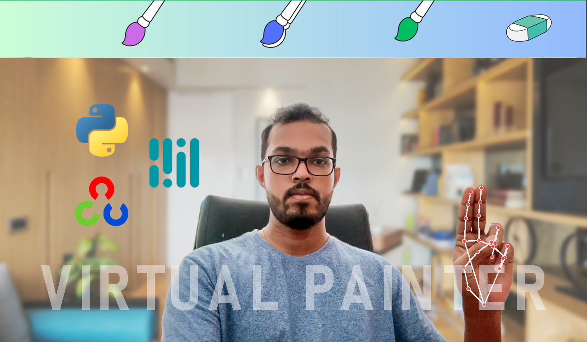

# Virtual Painter




This project implements a virtual painter using Python, OpenCV, and Mediapipe. It allows users to draw on a virtual canvas using hand gestures captured via a webcam.

## Features

- Hand tracking to detect hand gestures
- Selection mode to choose drawing colors and tools
- Drawing mode to create artwork on a virtual canvas

## Setup

1. Install Python (if not already installed)
2. Install required libraries:
   ```bash
   pip install opencv-python
   pip install mediapipe
